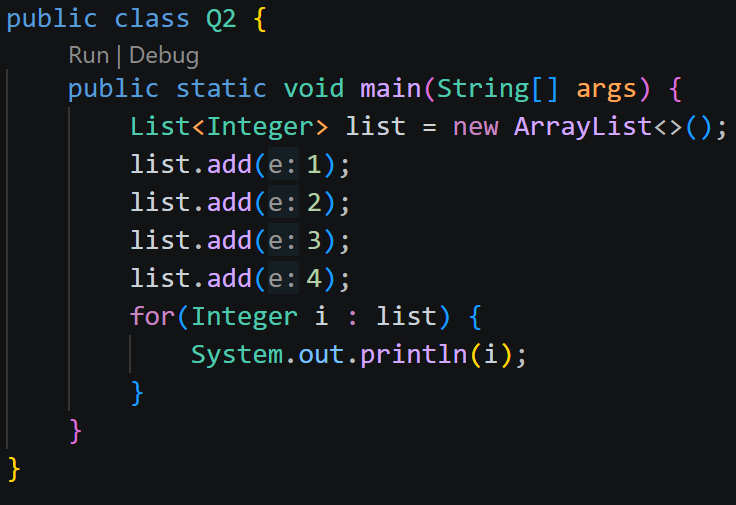
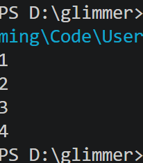

# task1
## Q1
- ##### 简单说一说他们各自的功能
    - `collection`：集合，用来存放一堆数据的容器。
        - `list`:数据的存放具有顺序，并且允许重复。
            - `arraylist`：数组结构，可以通过下标快速查找数据。
            - `linkedlist`：链表结构，只能顺序访问数据，但插入和删除比较方便。
        - `set`：数据不要求有顺序， 不允许重复。
            - `hashset`：哈希结构的集合，数据不会重复，也没有顺序。
            - `treeset`：树结构的集合，数据不会重复，有顺序。
    - `map`:存放键值对的集合，可以通过key（键）快速找到value（值）
        - `hashmap`：哈希结构的map，key没有顺序。
        - `treemap`：树结构的map，key会排序。
- ##### 概括一下数组与集合的区别
数组是固定长度的，创建之后就没办法更改了，而集合可以动态的增加长度。
数组可以直接存放基本数据类型，集合需要包装类。
集合有很多方便的对数据的操作方法。

## Q2
- ##### 请你用增强for循环遍历list中的元素 依次打印出结果 给出你的代码和运行结果截图

